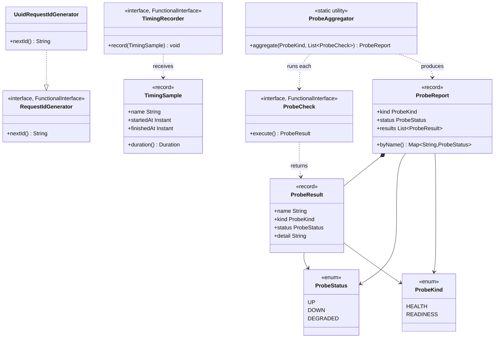
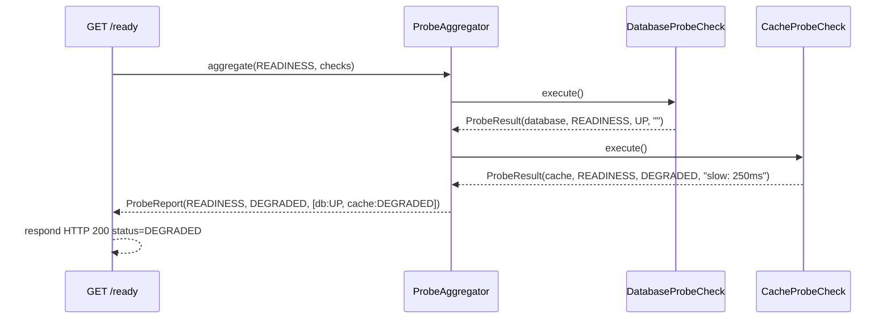

# ether-observability-core

Pure Java 21 observability contracts — zero production dependencies. Defines the interfaces and value types that every ether module depends on for request correlation, timing, and health probing. Implementations plug in without touching any ether internals.

## Coordinates

```xml
<dependency>
    <groupId>dev.rafex.ether.observability</groupId>
    <artifactId>ether-observability-core</artifactId>
    <version>8.0.0-SNAPSHOT</version>
</dependency>
```

**Runtime dependencies:** none. JUnit Jupiter is test-scoped only.

## Design philosophy

The library contains no framework code, no logging framework, no serialization, and no optional dependencies. Every type is either an interface, a record, or an enum. The result is a module that can be pulled into any other library in the ether ecosystem without transitive dependency conflicts. Implementations such as Glowroot or Micrometer adapters live in separate modules and depend on this one.

---

## Package overview

| Package | Purpose |
|---|---|
| `dev.rafex.ether.observability.core.request` | Request ID generation contracts |
| `dev.rafex.ether.observability.core.timing` | Operation timing contracts |
| `dev.rafex.ether.observability.core.probe` | Health and readiness probe contracts |

---

## Architecture: contracts and plug-in points



---

## Request ID generation

`RequestIdGenerator` is a `@FunctionalInterface` with a single method `nextId()`. The built-in implementation delegates to `UUID.randomUUID()`.

```java
// Built-in implementation — no configuration needed
RequestIdGenerator generator = new UuidRequestIdGenerator();
String id = generator.nextId();
// => "550e8400-e29b-41d4-a716-446655440000"
```

### Custom implementation: propagate an incoming trace ID

When your service sits behind a gateway that injects a `X-Trace-Id` header, you want to reuse that value rather than generating a new UUID. Implement `RequestIdGenerator` and fall back to UUID when the header is absent.

```java
package com.example.observability;

import dev.rafex.ether.observability.core.request.RequestIdGenerator;
import java.util.UUID;
import java.util.function.Supplier;

/**
 * Reuses an incoming trace ID from a gateway; falls back to UUID.
 */
public final class TraceAwareRequestIdGenerator implements RequestIdGenerator {

    private final Supplier<String> traceIdSupplier;

    public TraceAwareRequestIdGenerator(Supplier<String> traceIdSupplier) {
        this.traceIdSupplier = traceIdSupplier;
    }

    @Override
    public String nextId() {
        var traceId = traceIdSupplier.get();
        if (traceId != null && !traceId.isBlank()) {
            return traceId;
        }
        return UUID.randomUUID().toString();
    }
}
```

Wiring it into a request pipeline (supplier reads from a ThreadLocal or request context):

```java
var generator = new TraceAwareRequestIdGenerator(
    () -> RequestContext.current().traceId()
);

// In the HTTP middleware / filter:
String requestId = generator.nextId();
exchange.response().header("X-Request-Id", requestId);
```

---

## Timing

`TimingSample` is an immutable record with `name`, `startedAt`, and `finishedAt`. It computes `duration()` on demand as `Duration.between(startedAt, finishedAt)`.

`TimingRecorder` is a `@FunctionalInterface`; its only method is `void record(TimingSample sample)`.

### Custom implementation: log slow operations

```java
package com.example.observability;

import dev.rafex.ether.observability.core.timing.TimingRecorder;
import dev.rafex.ether.observability.core.timing.TimingSample;
import java.time.Duration;
import java.util.logging.Logger;

public final class SlowOperationTimingRecorder implements TimingRecorder {

    private static final Logger LOG =
        Logger.getLogger(SlowOperationTimingRecorder.class.getName());

    private final Duration threshold;

    public SlowOperationTimingRecorder(Duration threshold) {
        this.threshold = threshold;
    }

    @Override
    public void record(TimingSample sample) {
        var elapsed = sample.duration();
        if (elapsed.compareTo(threshold) >= 0) {
            LOG.warning("SLOW [%s] took %d ms (threshold %d ms)".formatted(
                sample.name(),
                elapsed.toMillis(),
                threshold.toMillis()
            ));
        }
    }
}
```

Using the recorder around an arbitrary operation:

```java
var recorder = new SlowOperationTimingRecorder(Duration.ofMillis(500));

var start = Instant.now();
// ... execute the operation ...
var finish = Instant.now();

recorder.record(new TimingSample("db.query.find-users", start, finish));
```

Because `TimingRecorder` is a functional interface you can also pass a lambda in tests or simple integrations:

```java
// Discard all samples
TimingRecorder noOp = sample -> {};

// Print to stdout
TimingRecorder printing = sample ->
    System.out.printf("%-40s %5d ms%n", sample.name(), sample.duration().toMillis());
```

---

## Health probes

### Type overview

| Type | Role |
|---|---|
| `ProbeCheck` | `@FunctionalInterface` returning a `ProbeResult` when `execute()` is called |
| `ProbeResult` | Record: `name`, `kind`, `status` (`UP`/`DOWN`/`DEGRADED`), `detail` (error message or empty) |
| `ProbeAggregator` | Static utility: runs a list of checks and returns a `ProbeReport` |
| `ProbeReport` | Record: `kind`, overall `status`, and `List<ProbeResult>`; also provides `byName()` |
| `ProbeStatus` | Enum: `UP`, `DOWN`, `DEGRADED` |
| `ProbeKind` | Enum: `HEALTH`, `READINESS` |

### Aggregation logic

`ProbeAggregator.aggregate()` applies the following rules in order:

1. If any check returns `DOWN`, the overall status is `DOWN` — early exit.
2. If no check returned `DOWN` but at least one returned `DEGRADED`, overall status is `DEGRADED`.
3. Otherwise the status is `UP`.

### Example: database and cache probe checks

```java
package com.example.health;

import dev.rafex.ether.observability.core.probe.*;
import javax.sql.DataSource;

public final class DatabaseProbeCheck implements ProbeCheck {

    private final DataSource dataSource;

    public DatabaseProbeCheck(DataSource dataSource) {
        this.dataSource = dataSource;
    }

    @Override
    public ProbeResult execute() {
        try (var conn = dataSource.getConnection();
             var stmt = conn.prepareStatement("SELECT 1")) {
            stmt.executeQuery();
            return new ProbeResult("database", ProbeKind.READINESS, ProbeStatus.UP, "");
        } catch (Exception e) {
            return new ProbeResult("database", ProbeKind.READINESS, ProbeStatus.DOWN,
                e.getMessage());
        }
    }
}
```

```java
package com.example.health;

import dev.rafex.ether.observability.core.probe.*;

public final class CacheProbeCheck implements ProbeCheck {

    private final CacheClient cache;

    public CacheProbeCheck(CacheClient cache) {
        this.cache = cache;
    }

    @Override
    public ProbeResult execute() {
        // Cache being slow is DEGRADED — the service continues with origin
        var start = System.currentTimeMillis();
        var reachable = cache.ping();
        var elapsed = System.currentTimeMillis() - start;

        if (!reachable) {
            return new ProbeResult("cache", ProbeKind.READINESS, ProbeStatus.DEGRADED,
                "cache unreachable; serving from origin");
        }
        if (elapsed > 200) {
            return new ProbeResult("cache", ProbeKind.READINESS, ProbeStatus.DEGRADED,
                "cache slow: %d ms".formatted(elapsed));
        }
        return new ProbeResult("cache", ProbeKind.READINESS, ProbeStatus.UP, "");
    }
}
```

### Example: run the aggregator and build a /health endpoint response

```java
package com.example.health;

import dev.rafex.ether.observability.core.probe.*;
import java.util.*;

public final class HealthEndpointHandler {

    private final List<ProbeCheck> readinessChecks;

    public HealthEndpointHandler(javax.sql.DataSource ds, CacheClient cache) {
        this.readinessChecks = List.of(
            new DatabaseProbeCheck(ds),
            new CacheProbeCheck(cache)
        );
    }

    /**
     * Returns a map suitable for JSON serialization.
     * HTTP 200 for UP/DEGRADED; HTTP 503 for DOWN.
     */
    public HealthResponse buildResponse() {
        var report = ProbeAggregator.aggregate(ProbeKind.READINESS, readinessChecks);

        var checks = new LinkedHashMap<String, String>();
        for (var result : report.results()) {
            var detail = result.detail().isBlank()
                ? result.status().name()
                : result.status().name() + ": " + result.detail();
            checks.put(result.name(), detail);
        }

        int httpStatus = report.status() == ProbeStatus.DOWN ? 503 : 200;
        return new HealthResponse(report.status().name(), checks, httpStatus);
    }

    public record HealthResponse(String status,
                                 Map<String, String> checks,
                                 int httpStatus) {}
}
```

Wired into an HTTP route for `GET /health`:

```java
// Inside your HTTP route handler:
var response = healthEndpointHandler.buildResponse();

exchange.status(response.httpStatus())
        .json(response);
// Produces: {"status":"DEGRADED","checks":{"database":"UP","cache":"DEGRADED: cache slow: 250 ms"}}
```

### Example: HEALTH vs READINESS probes (Kubernetes pattern)

Kubernetes uses two separate probe endpoints with different semantics:

- `GET /health` **(liveness)** — is the JVM alive and not deadlocked? A failure triggers a pod restart.
- `GET /ready` **(readiness)** — are all dependencies available? A failure removes the pod from the load balancer without restarting it.

```java
// Liveness: just confirm the JVM thread pool is not stuck
ProbeCheck jvmCheck = () ->
    new ProbeResult("jvm", ProbeKind.HEALTH, ProbeStatus.UP, "");

ProbeReport livenessReport = ProbeAggregator.aggregate(
    ProbeKind.HEALTH,
    List.of(jvmCheck)
);
// => ProbeReport(kind=HEALTH, status=UP, results=[jvm:UP])


// Readiness: check all external dependencies
ProbeReport readinessReport = ProbeAggregator.aggregate(
    ProbeKind.READINESS,
    List.of(
        new DatabaseProbeCheck(dataSource),
        new CacheProbeCheck(cacheClient)
    )
);

// byName() gives a flat map useful for structured JSON output
Map<String, ProbeStatus> statusByName = readinessReport.byName();
// => {"database": UP, "cache": DEGRADED}
```

---

## Sequence: probe aggregation flow



---

## Testing

All types are records or interfaces, making them straightforward to test without mocking frameworks:

```java
import dev.rafex.ether.observability.core.probe.*;
import dev.rafex.ether.observability.core.request.*;
import dev.rafex.ether.observability.core.timing.*;
import org.junit.jupiter.api.Test;
import java.time.Instant;
import java.util.List;
import static org.junit.jupiter.api.Assertions.*;

class ObservabilityCoreTest {

    @Test
    void uuidGeneratorProducesNonBlankId() {
        var gen = new UuidRequestIdGenerator();
        assertFalse(gen.nextId().isBlank());
    }

    @Test
    void timingSampleComputesDuration() {
        var start = Instant.parse("2026-01-01T10:00:00Z");
        var finish = Instant.parse("2026-01-01T10:00:01Z");
        var sample = new TimingSample("op", start, finish);
        assertEquals(1_000L, sample.duration().toMillis());
    }

    @Test
    void aggregatorReturnsDownWhenAnyCheckFails() {
        ProbeCheck up   = () -> new ProbeResult("a", ProbeKind.READINESS, ProbeStatus.UP, "");
        ProbeCheck down = () -> new ProbeResult("b", ProbeKind.READINESS, ProbeStatus.DOWN, "db offline");

        var report = ProbeAggregator.aggregate(ProbeKind.READINESS, List.of(up, down));
        assertEquals(ProbeStatus.DOWN, report.status());
        assertEquals(2, report.results().size());
    }

    @Test
    void aggregatorReturnsDegradedWhenSomeDegraded() {
        ProbeCheck up       = () -> new ProbeResult("db",    ProbeKind.READINESS, ProbeStatus.UP, "");
        ProbeCheck degraded = () -> new ProbeResult("cache", ProbeKind.READINESS, ProbeStatus.DEGRADED, "slow");

        var report = ProbeAggregator.aggregate(ProbeKind.READINESS, List.of(up, degraded));
        assertEquals(ProbeStatus.DEGRADED, report.status());
    }

    @Test
    void byNameReturnsCorrectMapping() {
        ProbeCheck up = () -> new ProbeResult("svc", ProbeKind.READINESS, ProbeStatus.UP, "");
        var report = ProbeAggregator.aggregate(ProbeKind.READINESS, List.of(up));
        assertEquals(ProbeStatus.UP, report.byName().get("svc"));
    }
}
```

---

## Type reference

| Type | Kind | Key members |
|---|---|---|
| `RequestIdGenerator` | `@FunctionalInterface` | `nextId(): String` |
| `UuidRequestIdGenerator` | Class | Implements `RequestIdGenerator` via `UUID.randomUUID()` |
| `TimingRecorder` | `@FunctionalInterface` | `record(TimingSample): void` |
| `TimingSample` | Record | `name`, `startedAt`, `finishedAt`, `duration()` |
| `ProbeCheck` | `@FunctionalInterface` | `execute(): ProbeResult` |
| `ProbeAggregator` | Static utility | `aggregate(ProbeKind, List<ProbeCheck>): ProbeReport` |
| `ProbeReport` | Record | `kind`, `status`, `results`, `byName()` |
| `ProbeResult` | Record | `name`, `kind`, `status`, `detail` |
| `ProbeStatus` | Enum | `UP`, `DOWN`, `DEGRADED` |
| `ProbeKind` | Enum | `HEALTH`, `READINESS` |

## License

MIT License — Copyright (c) 2025–2026 Raúl Eduardo González Argote
